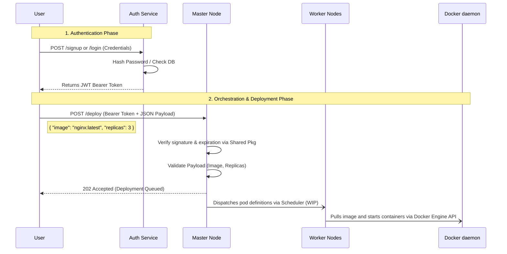

# 🚀 Mini-K8s (Mini Kubernetes)

A lightweight container orchestration system mimicking the core architecture of Kubernetes. Built from the ground up in Go, this project manages clusters of nodes, authenticates requests, and automatically schedules and deploys Docker containers across worker nodes.

## 🏗️ Architecture & Workflow

Mini-K8s is built using a distributed microservices architecture. Below is the high-level request lifecycle demonstrating the authentication and deployment flow:



## 🧩 Active Microservices

- **Auth-Service (:`8080`)**: The gateway for identity. Handles user registration, authentication, and securely issues cross-service JWTs backed by PostgreSQL and bcrypt.
- **Master Node (:`8081`)**: The orchestrator. Currently exposes a fully JWT-protected `/deploy` API waiting to schedule and distribute container workloads. 
- **Shared Pkg (`pkg/`)**: The shared brain. Contains unified business logic and middleware (like JWT verification) imported directly by both the `auth-service` and the `master` node.
- **Worker Node (`worker/`)**: The compute node that physically hosts and spins up the Docker containers requested by the master. Integrates directly with the Docker Daemon via the official Moby SDK.

## 🛠️ API Routes

| Service | Method | Route | Auth Required? | Purpose |
| :--- | :--- | :--- | :--- | :--- |
| `Auth` | `POST` | `/signup` | No | Register a new user |
| `Auth` | `POST` | `/login` | No | Authenticate and receive a JWT |
| `Auth` | `GET`  | `/verify` | Yes | Validates token and returns User info |
| `Master`| `POST` | `/deploy` | Yes | Receives Docker container manifests |

## 🚀 Getting Started

### Prerequisites
- Go 1.22+
- PostgreSQL Database running locally
- Git

### Environment Variables
For the services to link up, you need a `.env` file sitting in your root directory:
```env
PORT=8080
MASTER_PORT=8081
SECRET_KEY=paste_a_secure_random_string_here
DB_HOST=localhost
DB_PORT=5432
DB_USER=postgres
DB_PASSWORD=your_password
DB_NAME=mini-kn8s
DB_SSLMODE=disable
```

### Running the Network
Because this is a microservice architecture, you fire up each module in its own runtime:
```bash
# Terminal 1: Spin up the Authentication gatekeeper
cd auth-service
go run main.go

# Terminal 2: Spin up the Master API Control Plane
cd master
go run main.go

# Terminal 3: Spin up the Worker Node
cd worker
go run main.go
```

## 📅 Development Journey

- **Day 4 (2026-04-19)**: Integrated the official Docker SDK (Moby API) into the Worker Node. Completed the Master-to-Worker `/deploy` pipeline, allowing the cluster to dynamically pull requested images and orchestrate live containers locally.
- **Day 3 (2026-04-14)**: Bootstrapped the `Master` node with a secure `/deploy` endpoint. Wired up context sharing, custom logging for the CLI, and cross-folder environment fallbacks to make booting up foolproof.
- **Day 2 (2026-04-13)**: Restructured the codebase. Extracted the JWT middleware to a shared `pkg/middleware` directory to be consumed dynamically by multiple services. Solidified the `/signup`, `/login`, and `/verify` API flows.
- **Day 1 (2026-04-12)**: Initial project kickoff. Designed the PostgreSQL schema using GORM and set up the foundation for JWT cryptography and bcrypt password hashing.
